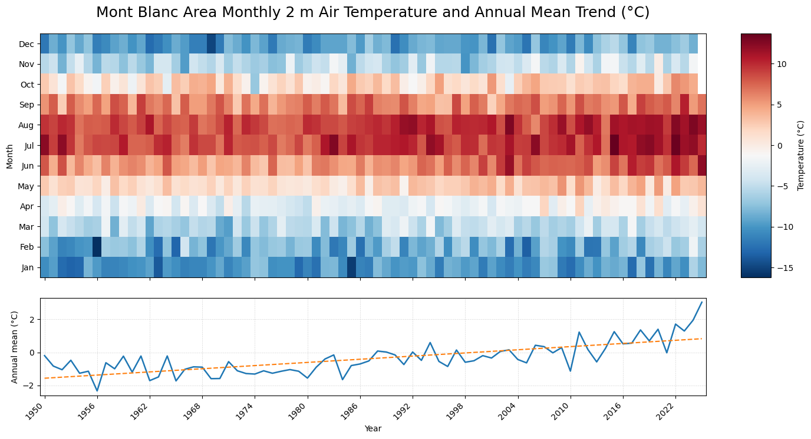

# Mont Blanc Accidentology and Climate Visualisation Project

This repository contains a project exploring links between climate change, mountain hazards, and accidentology in the Mont Blanc massif.

The project website is available here:

https://climatepirate.github.io/mont-blanc-accidentology/

## Example Outputs

###Data Analysis:

###Html Webpage:

## Project Summary

This project combines climate data analysis, geospatial processing, visual communication, and interactive web design to examine how changing temperature conditions may relate to mountain hazard patterns in the Mont Blanc region.

The final website presents the project narrative, visual outputs, and supporting interpretation.

## Repository Structure

- `index.html` — rendered project website
- `index.qmd` — Quarto source file for the website
- `Inserts/` — images, videos, and visual assets used in the website
- `code/` — cleaned analysis notebooks used to create selected project outputs
- `references.bib` — bibliography file for the Quarto project
- `stylesheet.scss` and `Bluebox.scss` — styling files

## Analysis Notebooks

The `code/` folder contains cleaned notebooks for:

1. Creating a Mont Blanc DEM mosaic from elevation raster tiles
2. Exporting annual temperature anomaly rasters from ERA5 2 m temperature data
3. Creating monthly temperature heatmaps and annual temperature trend visualisations

Large raw climate datasets and derived raster outputs are not included because of file size constraints.

## Skills Demonstrated

- Python climate data analysis
- NetCDF handling with `xarray`
- Geospatial raster processing with `rasterio` and `rioxarray`
- Temperature anomaly calculation
- Data visualisation with `matplotlib`
- Quarto website development
- Scientific communication and project storytelling
