## Mont Blanc Case Study

::::::::: columns
::::: {.column width="29%"}
::: {.bluebox style="background-color:#6B96B1; color:white; padding:1em; border-radius:0px;"}
<p><strong>Mont Blanc △</strong></p>

<p>

<strong>Where:</strong> Western Alps - France

<strong>Elevation:</strong> 4806 m

<strong>Lat, Long:</strong> 45.8326° N, 6.8652° E

</p>

<strong>Nearest Town:</strong> Chamonix
:::

::: {.greybox style="background-color:#CA3940; color:white; padding:1.1em; margin-top:10px; border-radius:0px;"}
<p>

<strong>Climbers Per Year:</strong> 20,000</strong> <br>

<strong>Fatalities Per Year</strong> ≈ 100

</p>
:::
:::::

::: {.column width="1%"}
<!-- empty column to create gap -->
:::

:::: {.column width="70%"}
::: {#fig-cern}
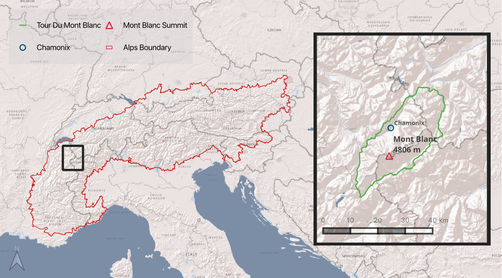{fig-align="center" width="98%"}

Study location map of the European Alps, Mont Blanc and main mountaineering routes © G.Douglas
:::
::::
:::::::::

------------------------------------------------------------------------

::: {style="background-color:#f2edec; padding:20px;"}
<span style="color:#6a7a8e; font-family:monospace;"> **Planetary Health** --- *The study of the interdependence between human health and the health of the planet's natural systems.*

[**Accidentology** --- *The study of the causes, effects and prevention of accidents.*]{style="color:#6a7a8e; font-family:monospace;"}
:::

------------------------------------------------------------------------

::::::: columns
::: {.column width="48%"}
#### The Significance of Accidentology

<br> Mountaineering stands for accomplishment, communion with divinity, and more recently, the acquisition of ecological consciousness, awakening the climber's respect for nature and deepens their environmental ethic [@wheeler2013]. Their safety and well-being—a core focus of Planetary Health—are under threat due to environmental instability caused by climate change. Accidentology tracks how safely people use ecosystem services, offering key evidence linking environmental degradation to physical trauma and informing planetary health principles.([Planetary Health Alliance](https://planetaryhealthalliance.org/themes/direct-injuries/)).
:::

::: {.column width="3%"}
<!-- empty column to create gap -->
:::

:::: {.column width="49%"}
::: {#fig-cern}
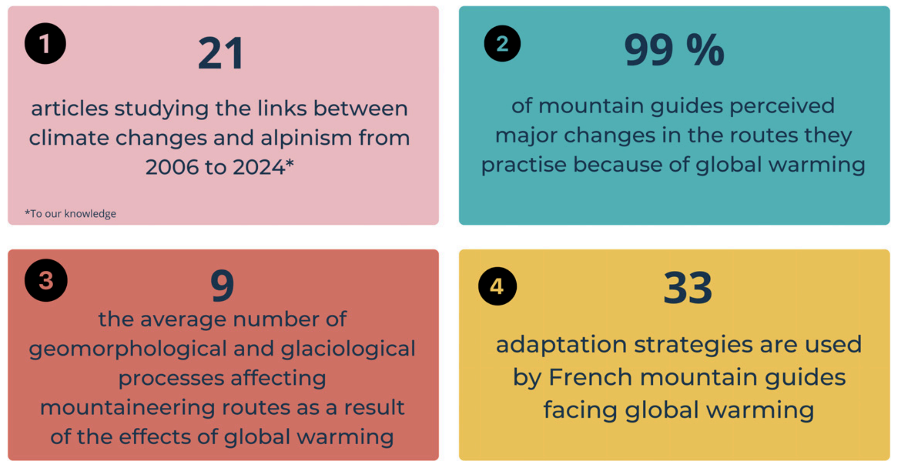{width="100%" fig-align="center"}

Infographic demonstrating the key findings from the articles studying links between global warming and alpinism in [@cailhol2025]. literature review.
:::
::::
:::::::

------------------------------------------------------------------------

#### The Significance of Mont Blanc

With approximately 20,000 climbers and 100 death annually, Mont Blanc (4,806 m a.s.l.) is among the world's most high-risk peaks [(Climb Mont Blanc)](https://climbmontblanc.com/about-mt-blanc). Its proximity to Chamonix and increasing commercialisation increases exposure to environmental hazards.

There are, on average, 35 fatal mountaineering accidents per summer in France [@mourey2022]. Between 1990 and 2017, the French mountain police conducted 347 rescue operations in the Goûter couloir, the ‘Normal Route’ of Mont Blanc, **alone**. This resulted in 102 deaths and 230 injuries, showing that the route presents a substantial objective danger[@mourey2018].

This study examines how climate change increases hazard and fatality risks in mountain environments by analysing data from the Petzl Foundation - [Accident Prevention Reports](https://www.petzl.com/fondation/s/prevenir-accidents?language=en_US) and [Camptocamp - SERAC](https://www.camptocamp.org/xreports). The goal is to identify causal links between warming, human health, and adaptation strategies for safety.

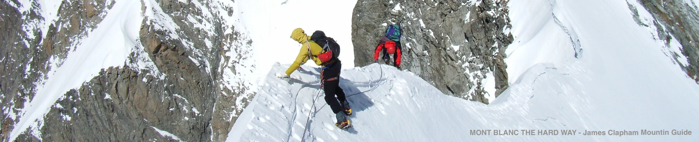

## A Warming Mountain

Mont Blanc, the highest summit of the European Alps, lies within the Mont Blanc Massif, 30% of which is covered with ice [@gardent2014]. This ice presents an immediate risk to mountain stability due to the impacts of global warming on ice and permafrost (ground that remains frozen for at least two consecutive years).

::::::: columns
::: {.column width="54%"}
<br> Local station data from [CREA Mont Blanc](https://atlas.creamontblanc.org/explorer/temperatures/) indicate that temperatures are rising more rapidly than elsewhere, by +2°C since 1864 and by +3°C by 2050, approximately twice the global average (from a 1981-2010 baseline). This warming is even more pronounced in summer and spring, the peak climbing season.

To visualise these changes more broadly, ERA5 Copernicus temperature anomaly data were used to map the mean air temperature (2 m above ground level) compared to a 1950-1980 temperature baseline [@copernicusclimatechangeservice2019].

Both datasets — local observation and global model — show the same pattern of steady warming, reinforcing confidence in the signal. The video illustrates this rise spatially, while plotted ERA5 averages provide a quantitative view (Figure 3). With further analysis, we could model the spatial spread of the raster data to illustrate locational temperature differences.

If greenhouse gas emissions —the main driver of global warming—persist at the current rate, Mont Blanc's warming will pose increasingly significant threats to human safety.
:::

::: {.column width="2%"}
<!-- empty column to create gap -->
:::

:::: {.column width="44%"}
::: {#fig-cern}
Visual Representation of Temperature Change and Accidents Over the Mont Blanc Area

```{=html}
<div style="height:60%; display:flex; flex-direction:column; justify-content:space-between;">
  <video id="climateVideo" width="90%" autoplay loop muted playsinline>
    <source src="Inserts/digital.mp4" type="video/mp4">
  </video>
  <p style="margin-top:8px; font-size:0.8em; text-align:left;">
  </p>
</div>

<script>
const video = document.getElementById('climateVideo');
const observer = new IntersectionObserver(entries => {
  entries.forEach(entry => {
    if (entry.isIntersecting) {
      video.play();
    } else {
      video.pause();
    }
  });
}, { threshold: 0.5 });
observer.observe(video);
</script>
```

Video time lapse of temperature anomaly compared to 1950-1980 baseline and camptocamp accident points. Generated using QGIS, OSM Basemaps, ERA5 Data, © OpenStreetMap contributors
:::
::::
:::::::

::: {#fig-cern}
```{r}
#| message: false
#| warning: false
#| echo: false
library(terra)
library(dplyr)
library(ggplot2)
library(plotly)

# 1. Load NetCDF
temp_nc <- rast("2m_temp.nc") 

n_layers <- nlyr(temp_nc)

# 2. Build synthetic monthly dates
dates <- seq(as.Date("1950-01-01"), 
             by = "1 month",
             length.out = n_layers)
years <- as.integer(format(dates, "%Y"))

# 3. Extract spatial means
vals_K <- global(temp_nc, mean, na.rm = TRUE)[, 1] 

ts_df <- data.frame(
  date   = dates,
  year   = years,
  temp_K = vals_K
)

# 4. Aggregate to yearly means in °C
annual_temp <- ts_df %>% 
  group_by(year) %>%
  summarise(mean_temp_C = mean(temp_K - 273.15, na.rm = TRUE))

# ggplot version (same look as your static plot)
p <- ggplot( 
  annual_temp,
  aes(
    x = year,
    y = mean_temp_C,
    group = 1,  # ensures a single continuous line
    text = paste0(
      "Year: ", year,
      "<br>Mean temp: ", round(mean_temp_C, 2), " °C"
    )
  )
) +
  geom_line(color = "#E97A3E", linewidth = 0.8) +
  geom_point(color = "#E97A3E", size = 1.5) +
  theme_minimal(base_size = 10) +
  labs(
    title = "Mean 2 m Air Temperature Over Time (Mont Blanc, ERA5)",
    x = "Year",
    y = "Mean Temperature (°C)"
  ) +
  theme(
    plot.title = element_text(hjust = 0, face = "bold"),
    axis.title = element_text(face = "bold")
  )

# interactive version
ggplotly(p, tooltip = "text") %>% 
  layout(width = 1000, height = 450)
```

**Hover over points to show data** - Change in air temperature of Mont Blanc over time, as measured 2 m above ground level. Average temperatures have trended upward over the two to three past decades.
:::

[***Attribution, Figure 3 & 4: Generated using or contains modified Copernicus Climate Change Service information \<2019\>. Neither the European Commission nor ECMWF is responsible for any use that may be made of the Copernicus information or data it contains.*** ***Map data copyrighted OpenStreetMap contributors and available from https://www.openstreetmap.org***]{style="font-size: 75%;"}

<br>

## Climate Related Hazards in the Mountains

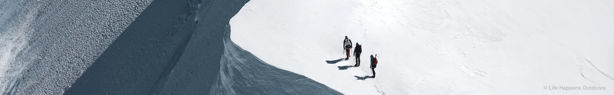

<p>

### Rockfall: A Marker of Mountain Instability

<p>

Rockfall, the detachment of a rock mass exceeding 100m³, is one of the most hazardous geomorphological processes due to its high mass and speed [@ravanel2017]. Studying them is essential for understanding landscape evolution and evaluating natural hazards.

#### Rockfall and Local Temperature Change

<br>

::::::: columns
:::: {.column width="48%"}
::: {#fig-cern}
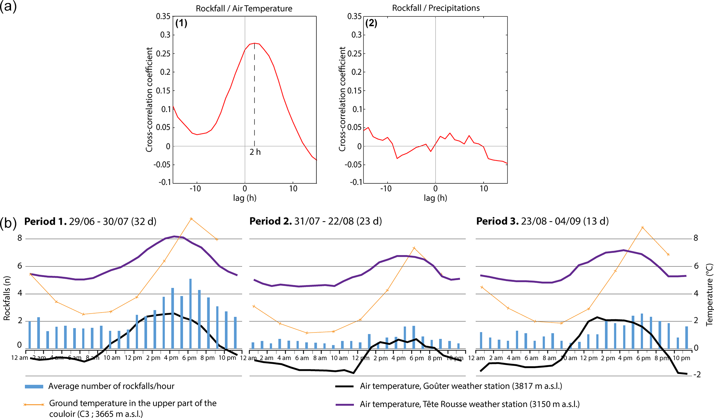{width="100%" fig-align="center"}

(a) Cross-correlation functions for the hourly rate of rockfalls. The blue dashed line highlights the time delay of 2 h between the hourly temperature and rockfall triggering. (b) Evolution over 24 h, for Periods 1-3, of (i) average number of rockfalls per hour, (ii) mean hourly ground temperature in the upper part of the couloir (C3), and (iii) mean hourly air temperatures at the Tête Rousse and the Goûter weather stations.
:::
::::

::: {.column width="3%"}
<!-- empty column to create gap -->
:::

::: {.column width="49%"}
Geographer Jacques Mourey’s research on the Grand Couloir du Goûter shows a clear link between rockfall frequency and rising ground and air temperatures (Figure 5) [@mourey2022a]. As permafrost thaws, water runoff reduces rock cohesion, destabilising slopes.\

Seasonally, rock falls occur most frequently during the period of snowpack melt at the start of summer (Period 1, Figure 5b). Cross-correlation analysis (Figure 5a) reveals that daily rockfall frequency is positively correlated with air temperature (r ≈ 0.3), peaking approximately two hours after temperature rise, when thermal expansion of rock surfaces stresses rock faces, posing the greatest risk to climbers.

While temperature is the dominant trigger studied, rainfall, slope angle, and rock type also influence susceptibility. A small proportion of rockfalls were linked to climber activity during early morning ascents, when natural triggers were minimal [@mourey2022].
:::
:::::::

------------------------------------------------------------------------

#### Global Warming and Rockfall

<p>

A 2012 study by the Swedish Society of Anthropology and Geography compiled an inventory of 50 significant rockfalls in the Mont Blanc region (1947-2009) through photo interpretation and a network of observers, including guides, hut keepers, and mountaineers [@ravanel2010].

::::::: columns
::: {.column width="44%"}
The study found that 70% of the rockfalls occurred during the past two decades, characterised by an acceleration of global warming [@deline2012]. As mean decadal air temperature rises, the number and volume of rockfalls increase sharply.

Taken together, Mourey’s study into the sensitivity of mountain environments to daily temperature changes supports Ravanel’s theory that long-term warming has a cumulative effect on slope instability.
:::

::: {.column width="1%"}
<!-- empty column to create gap -->
:::

:::: {.column width="55%"}
::: {#fig-cern}
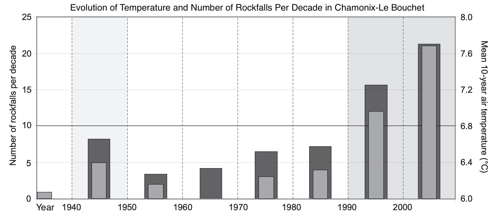{fig-align="center" width="100%"}

Comparative evolution of the decadal mean temperature (dark gray bars) in Chamonix-Le Bouchet (1040 m a.s.l.) and the number of rockfalls per decade (light gray bars) since the 1940s.
:::
::::
:::::::

------------------------------------------------------------------------

::::::: columns
::: {.column width="48%"}
#### Are these increases due to better reporting?

Increased footfall may improve reporting; however, multiple lines of evidence show that the rise in rockfall activity reflects real environmental change:

• **Diverse data sources** — rockfalls are documented through field observation, remote sensing, and photographic analysis, reducing observer bias.

• **Rising magnitude** — studies show larger and more numerous rockfalls over time, independent of reporting effort.

• **Shifting altitude** — events are increasingly concentrated at higher elevations, indicating progression of permafrost degradation.
:::

::: {.column width="2%"}
<!-- empty column to create gap -->
:::

:::: {.column width="50%"}
Significant Rockfall on Trident du Tacul in Mont Blanc Massif

::: {layout-ncol="2"}
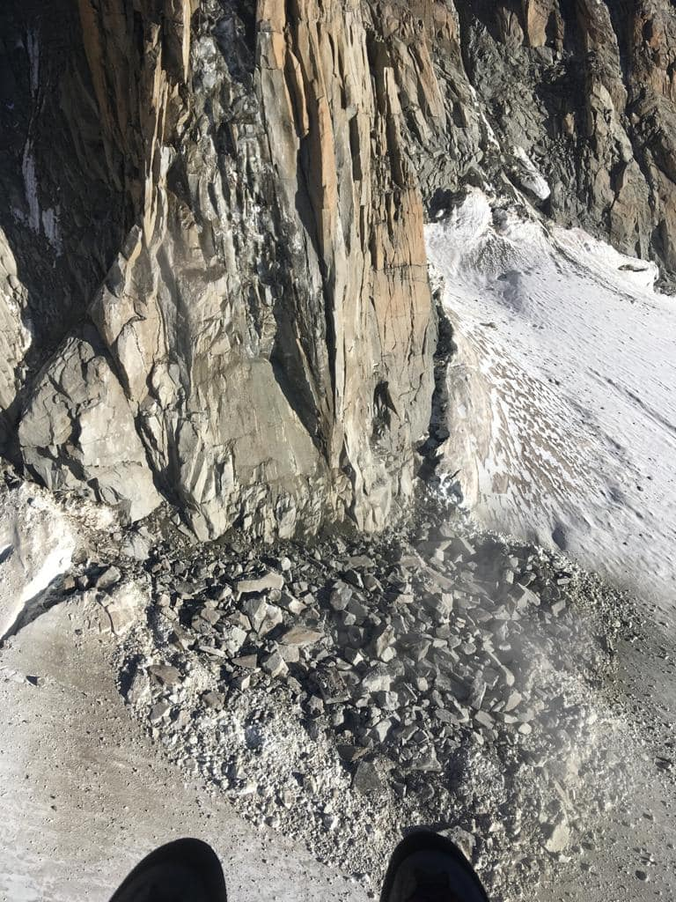

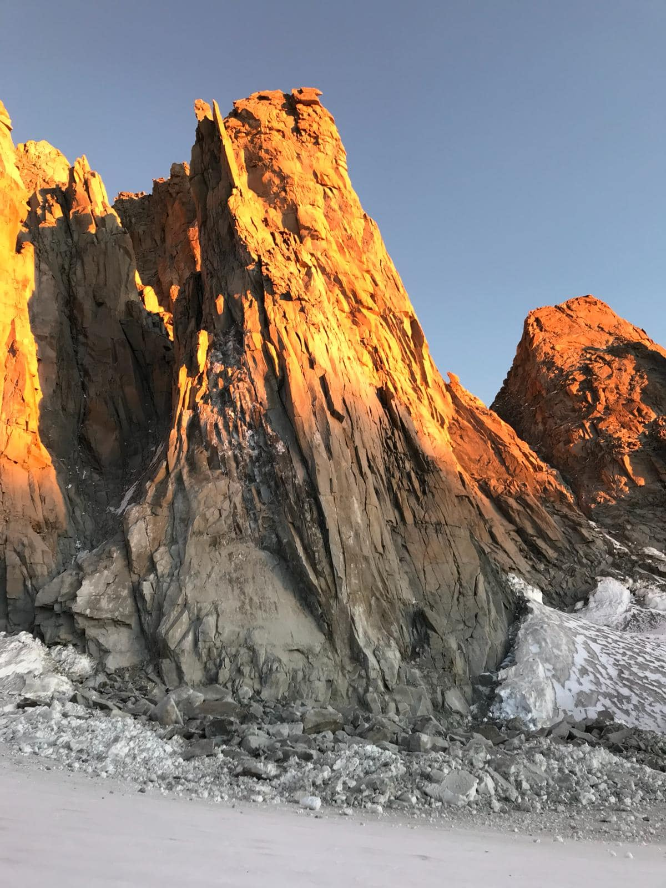
:::
::::
:::::::

## Accidentology

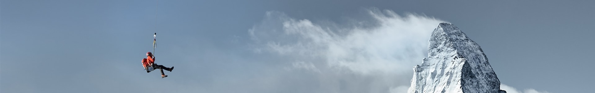

::::::: columns
::: {.column width="43%"}
<br>

#### Are there just more climbers?

<br> **Yes** - the increased footfall rate is identical to the increase in the number of accidents [@mourey2018].

This does not mean that risk conditions are constant. Climate change is a key driver in reshaping the proportions of accidents, not just their frequency. Unstable permafrost, rock falls, and unpredictable weather interact with the growing number of less experienced climbers, closing the gap between human error and environmental danger.
:::

::: {.column width="2%"}
<!-- empty column to create gap -->
:::

:::: {.column width="55%"}
::: {#fig-cern}
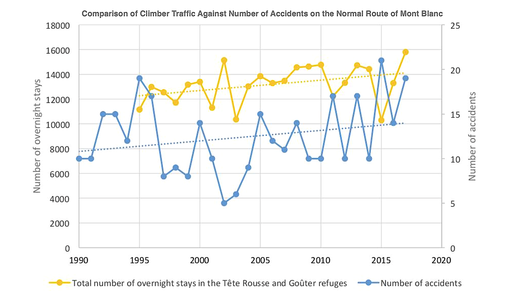{width="100%" fig-align="center"}

Variation in the total number of overnight stays at the Tête Rousse and Goûter refuges between 1995 and 2017 (left) and variation in the number of accidents between 1990 and 2017 (right).
:::
::::
:::::::

------------------------------------------------------------------------

### Framing Accidentology as Climate Data

<p>

:::::: columns
::: {.column width="80%"}
Accidentology remains a challenging phenomenon to quantify precisely. Rescue data has historically been fragmented and difficult to access. Meaningful insights can be drawn from analysing the conditions that increase accident likelihood alongside raw incident counts ([Camptocamp](https://www.camptocamp.org/xreports?limit=30&bbox=734928,5721968,803302,5805581)).
:::

::: {.column width="1%"}
<!-- empty column to create gap -->
:::

::: {.column width="19%"}
{width="70%" fig-align="center"}
:::
::::::

Maud Vanpoulle’s [Accidentology of Mountain Sports](https://petzl.my.salesforce.com/sfc/p/#20000000HrHq/a/680000004SNf/cN4Zn1jzC7kbWjlcbZNrWO.mezxVs3aXDQexC1jRSjo), examines the Camptocamp database to understand the underlying factors behind mountaineering incidents — from physical conditions to human behaviour and decision-making

::::::: columns
:::: {.column width="65%"}
::: {#fig-cern}
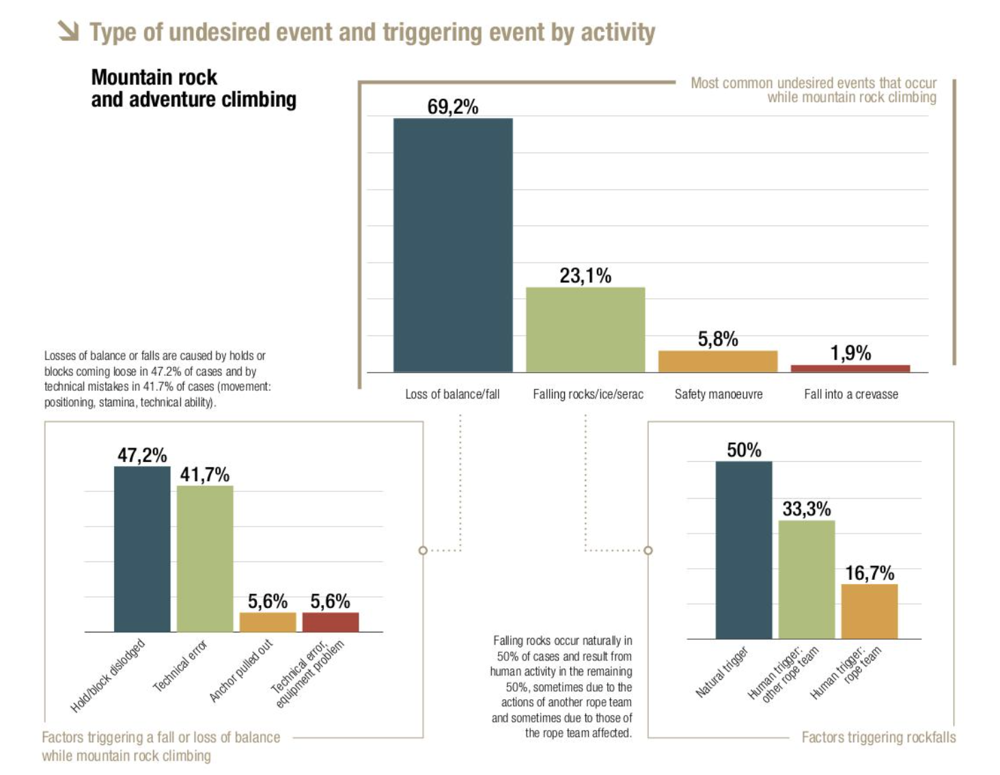{width="100%" fig-align="center"}

Vanpoulle's analysis of the Camptocamp database; Most common undesired events and the main triggers of Loss of Balance and Falling Rock/ice .Image credit: Maud Vanpoulle 2022
:::
::::

::: {.column width="2%"}
<!-- empty column to create gap -->
:::

::: {.column width="33%"}
<br>

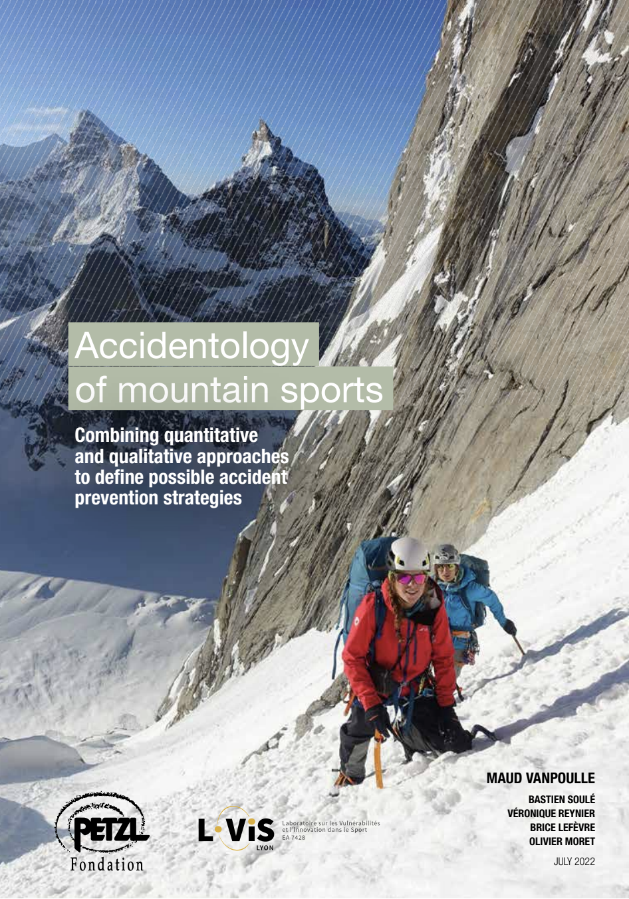
:::
:::::::

<p>

Vanpoulle’s analysis of the SERAC data shows that rockfall accounts for 31.8% of mountaineering accidents recorded (figure 1), with around half attributed to natural triggers. The remainder are linked to human activity, supporting Jaques findings that climbers can also initiate rockfalls through movement or noise.

Rockfalls are likely under reported, as data typically only consider direct impacts. Indirect effects, such as slips caused by averted attention when looking out for rockfall and rushing to avoid rockfall-prone areas, are harder to capture.

The identification of rockfall as a recurrent accident trigger, when viewed alongside evidence of climate-driven increases in rockfall frequency, establishes accidentology as a valuable proxy for monitoring the evolving risk landscape in mountaineering.

A quantitative projection linking rockfall frequency trends to future fatality risk could strengthen this analysis, but such modelling lies beyond the scope of the present work. The conceptual framework outlined here provides the basis for that future development.

#### ⚠ Other Hazards

Global warming also heightens risks from avalanches, crevasses, icefall, cornice collapse, and extreme weather (Figure 8). These climate-driven instabilities further underscore the dangers presented by global warming to mountaineers. This study could be further developed by incorporating statistical research into these factors.

<br>

## Future of Mountain Safety

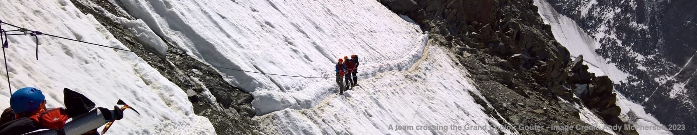

::: {style="background-color:#CA3940; padding:20px; text-align: center;"}
[“Our data set shows that climbers are not aware of the variations in rockfall frequency and/or cannot or will not adapt their behavior to this hazard.”]{style="color:white; font-family:monospace;"}

-- Jacques Mourey 2022
:::

### How can we minimize future mountain-related accidents?

:::::: columns
::: {.column width="49%"}
#### 1. Improve Mountain Safety

Immediate risk reduction focusing on adaptation:

-   Encourage ascents during safer times of day or season.

-   Limit mountain footfall to reduce congestion in rockfall zones.

-   Improve climbers’ technical and decision-making skills through guided education.
:::

::: {.column width="1%"}
<!-- empty column to create gap -->
:::

::: {.column width="50%"}
#### 2. Climate Action in the Community

Climbers can contribute to climate change mitigation by:

-   Choosing local climbs and reducing air travel.

-   Using low-carbon transport such as train links to alpine regions.

-   Supporting climate advocacy and conservation initiatives within the climbing community.
:::
::::::

<p>

:::::::: columns
::: {.column width="49%"}
#### 3. Communication and Awareness

<br>

In Figure 9, projected data onto a 3D map of Mont Blanc demonstrates how climate and accident data can be transformed into a visual language climbers already use to understand risk and terrain.

Place-based education builds on familiarity, linking scientific information to lived experience [@semken2017]. By grounding climate concepts that might otherwise seem abstract, this tool fosters reflection and climate-conscious action without asking climbers to disengage from the mountain.

Installed in mountain huts, it could feature at climbing festivals, such as the [Science and Mountain Festival](https://montagnes-sciences.fr/) in Grenoble, or at other popular peaks, like Gran Paradiso. Additional climate data, such as snow cover, and interactive route-specific features could enhance its utility. Its impact could be evaluated through surveys of climbers’ understanding, perspectives, and emotional responses.
:::

::: {.column width="2%"}
<!-- empty column to create gap -->
:::

:::: {.column width="49%"}
::: {#fig-cern}
```{=html}
<video id="3DVideo" width="100%" autoplay loop muted playsinline>
  <source src="Inserts/flatview2.mp4" type="video/mp4">
</video>
<script>
const video = document.getElementById('3DVideo');
const observer = new IntersectionObserver(entries => {
  entries.forEach(entry => {
    if (entry.isIntersecting) {
      video.play();
    } else {
      video.pause();
    }
  });
}, { threshold: 0.5 });
observer.observe(video);
</script>

© G.Douglas
```

Climate timelapse data from Figure 3 projected onto 3D Printed Mont Blanc for novel data visualization and potential installation (strobe effect is due to camera vs projection frame rate differences, projection colours are consistent in person) 3D print file generated from https://maps3d.io/
:::
::::

<br>

::: {style="background-color:#f2edec; padding:20px; font-size: 1.1em;"}
## Final Remarks

These findings underscore the interconnection between planetary health and mountaineer safety.

Global warming and its cascading effects on natural hazards directly demonstrate how environmental degradation exacerbates health and safety risks for populations reliant on ecosystem services.

This Mont Blanc case study illustrates that protecting human health relies on safeguarding natural systems, thereby reinforcing the core principles of Planetary Health.
:::
::::::::
